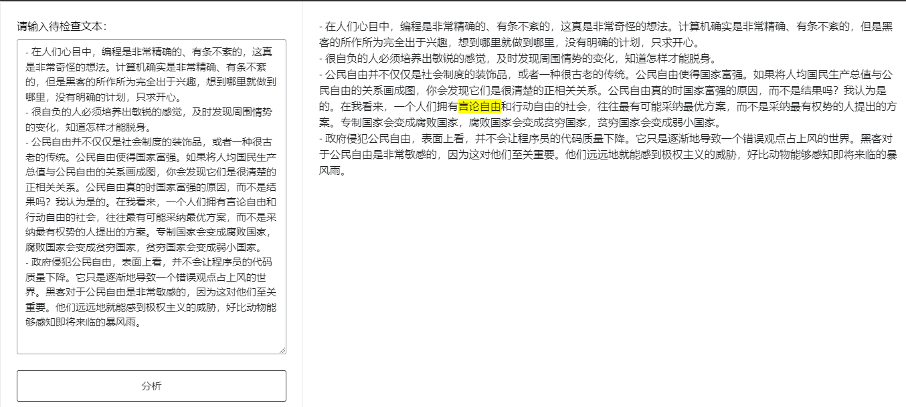

# 文本内容安全识别

这是识别社交媒体违禁词的应用，使用了以下工具：

1. [Shiny for Python](https://shiny.posit.co/py/)：网页应用搭建。
2. [文本内容安全-腾讯云](https://cloud.tencent.com/product/tms)：文本内容安全识别服务。
3. [Shiny Server](https://posit.co/products/open-source/shinyserver/)：服务器部署 Shiny 应用。

## 应用示例

## 简要操作步骤

1. `git clone https://github.com/Shitao5/tms-shiny.git`
2. `pip install -r requirements.txt`
3. 腾讯云内容安全服务开通：根据[「控制台-内容安全-概览」](https://console.cloud.tencent.com/cms)中的说明开通服务。
4. 创建 [API 密钥](https://console.cloud.tencent.com/cam/capi)，修改 `app.py` 中的 `YOUR_SecretId` 和 `YOUR_SecretKey`。
5. 根据 [Shiny 文档](https://shiny.posit.co/py/docs/deploy.html#deploy-to-shiny-server-open-source)部署。
6. 